# Box统计指南

## 开始使用
首先打开[Box统计系统](https://boxcolle.xcwbot.com/)，打开后如下图：
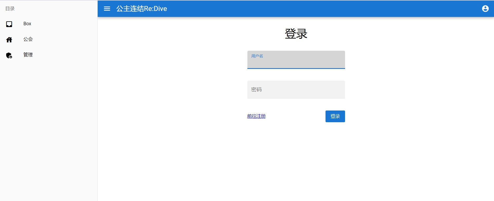
如果之前有注册过账号，可以直接登录。  
如果你是第一次使用，请点击登录按钮左侧的“前往注册”链接并按照其中指引进行注册，然后进行登录。
## 主界面
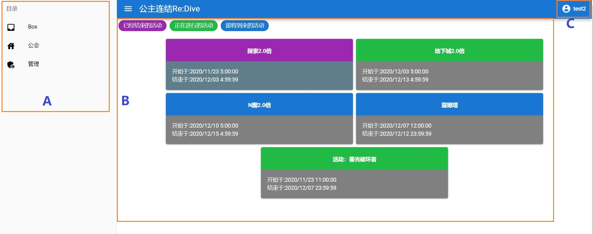
登录后的主界面如上图。  
图中字母代表的功能区分别是：  
A：侧边栏：可以快速切换功能  
B：日程表：显示当前正在进行或即将进行的活动  
C：账号面板：可以查看当前登录账号的信息
## Box设置
在侧边栏上点击“Box”，切换到Box设置界面，如下：
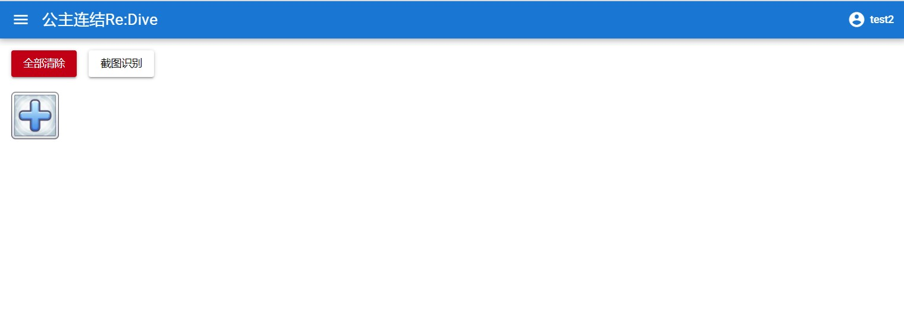
点击“+”号可弹出角色选择面板：
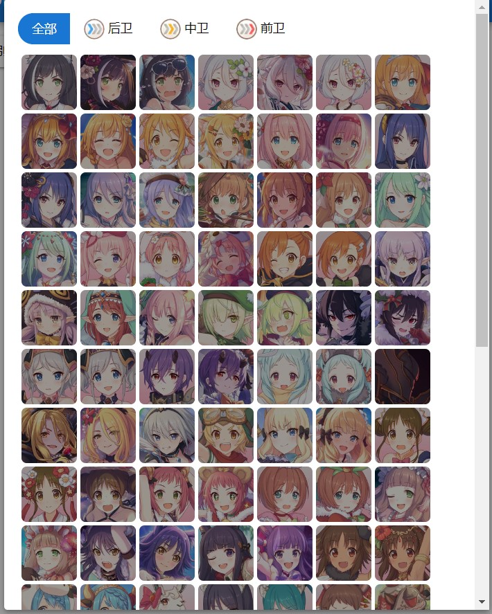  
点击角色头像即可进行选择。
选择完毕后，鼠标移至角色头像上即可查看角色详情（星级，RANK，专武）：  
    
如果星级，RANK，专武设置有误，点击角色头像可以修改：  
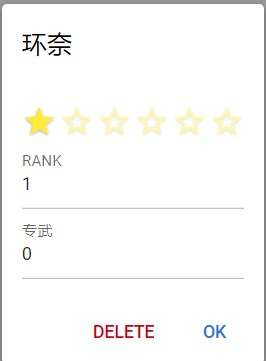      
此外，还可以使用上传截图的方式进行添加，请根据其指引操作，此处不再赘述。
## Box统计
### 对于公会成员：
切换至“公会”界面，如果你还未在此处加入任何公会的话，会看到公会列表：
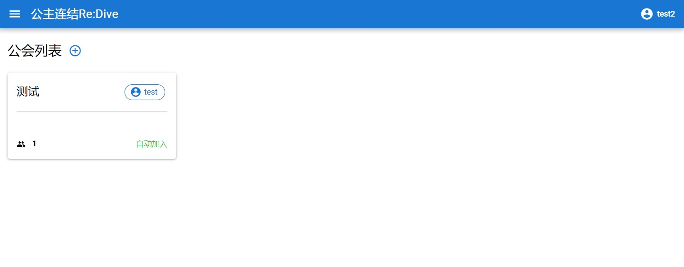  
请从其中找到你所在的公会并加入即可。  
加入公会后，即可查看同公会的成员名单及他们的Box，此处就不再说明详细操作。
### 对于公会管理者：
切换至“公会”界面，如果你没有创建公会的话，请点击“公会列表”右侧的“+”号创建公会。  
创建公会后会自动跳到公会信息面板，在此处你可以设置公会名称，公会签名，加入公会的审核方式：
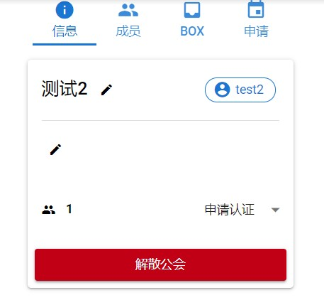  
在“申请”选项卡下可以处理公会成员的加入申请：
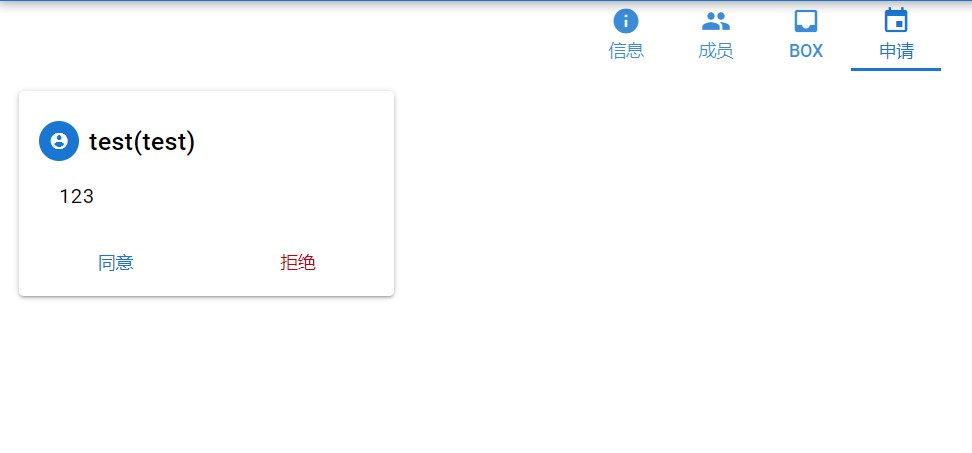
在“成员”选项卡下可以查看已加入公会的成员信息：
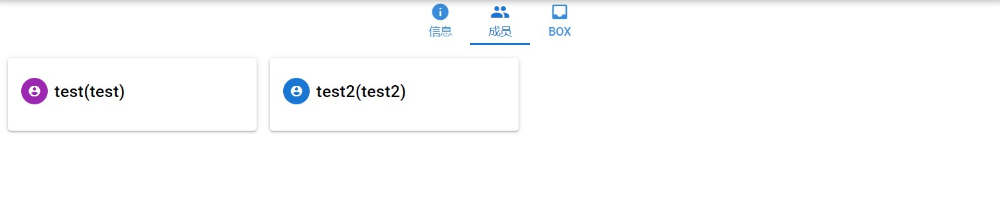  
在“Box”选项卡下可以查看公会内成员的Box信息（如果设置了的话）：
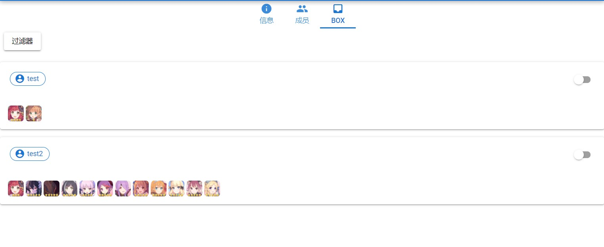
使用过滤器还可以快速筛选出Box符合要求的成员：
1. 点击“过滤器”按钮
2. 显示出现在生效的过滤器：
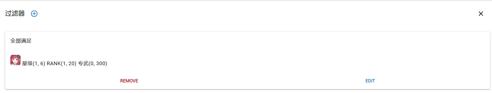
3. 点击“过滤器”旁的“+”号可以添加新的过滤器，点击每个过滤器下方的“REMOVE”可以删除这个过滤条件，点击“EDIT”可以编辑过滤条件：

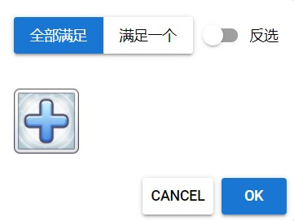  
<i>添加过滤器并设置全部角色需要满足的条件</i>

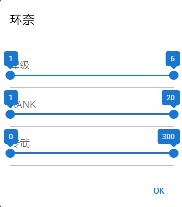  
<i>选择角色并设置该角色需要满足的条件</i>

