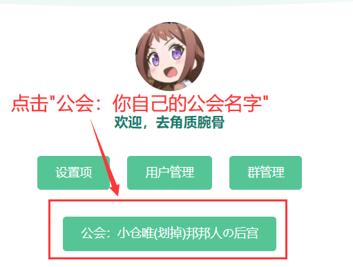
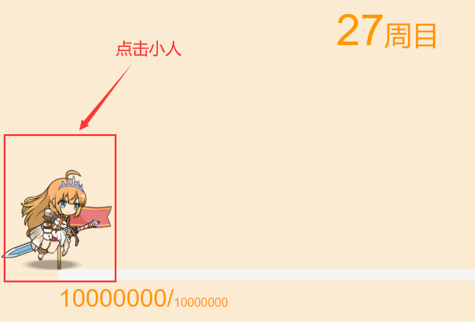
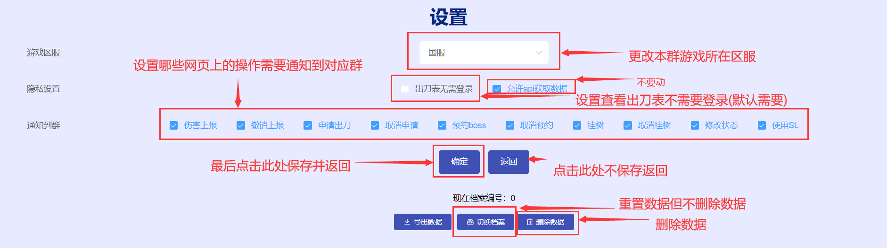
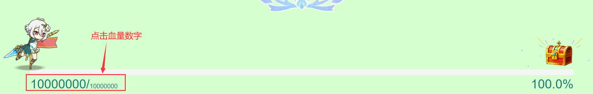
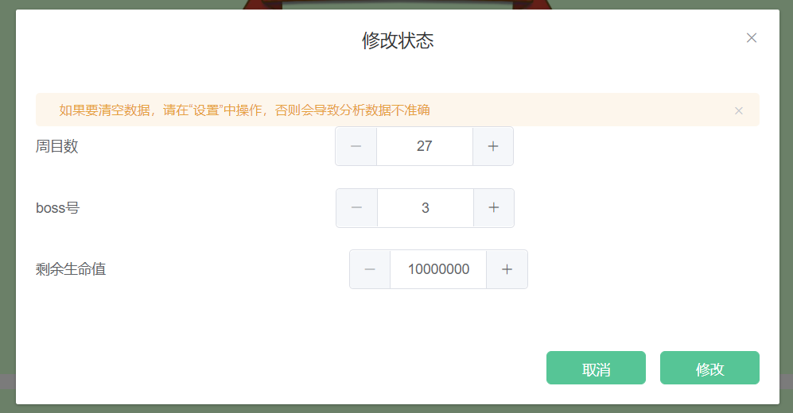
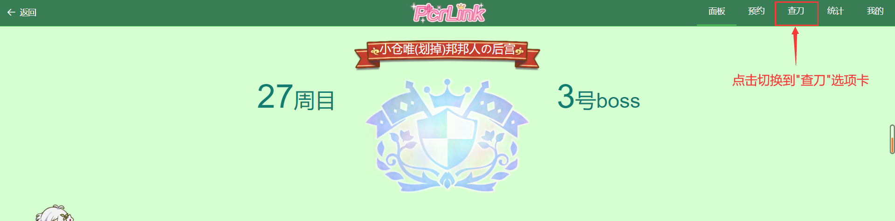
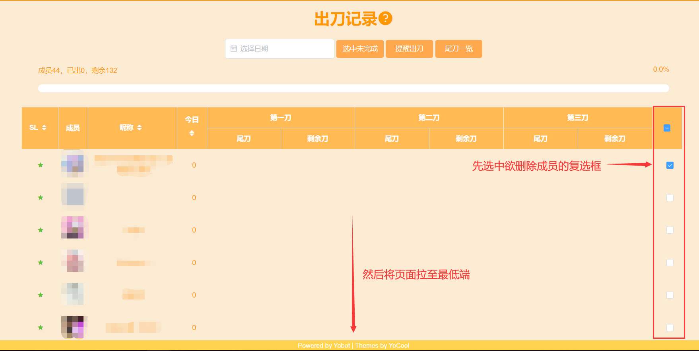
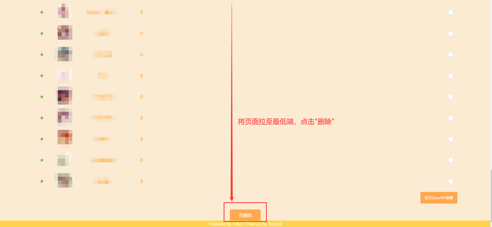

## 常见问题
### 1. <b>机器人经常自说自话？</b>  
   解决方法:   
   在群中发送`禁用 AI闲聊` 或 `禁用 时报`。

### 2. <b>如何重置会战数据&调整公会属性、调整血量和删除成员？</b>   
   解决方法:        
   先进入会战管理系统网页端主页(向会战机器人<b>私聊</b>发送`登录`)：  
     

   重置会战数据&调整公会属性：  
       
      

   调整血量：  
      
      

   删除成员：  
      
      
      

### 3. <b>如何上报补偿刀？</b>  
   解决方法:    
   系统会自动将尾刀后同一人的下一刀计为补偿刀，所以直接使用`报刀 50000`即可。

### 4. <b>修改状态或者催刀等操作时提示权限不足，而我已经是群主/群管理员了，怎么办？</b>    
   解决方法:  
   请联系Bot维护组更改权限。

### 5. <b>报错刀了怎么办？</b>  
   解决方法:    
   自己报错刀了，请使用`撤销`命令；  
   如果其他人报错刀了，请联系管理员或群主撤销。  
   如果已经过去太久，请直接修改Boss状态。

### 6. <b>跨日出刀/昨日刀怎么报？</b>  
   解决方法:    
   如果结算时是游戏中的第二天，则直接报刀；  
   如果结算时是游戏中的前一天，报刀时是游戏中的第二天，则使用`报刀/尾刀 50000 昨日`即可。

### 7. <b>为什么Bot理别人不理我？</b>  
   解决方法:    
   有可能是：骂了Bot，请等一个小时之后自动解除；  
   也有可能是：你的昵称(群昵称)中包含了敏感字词，请尝试更改昵称再试。

### 8. <b>为什么加入了公会在网页端却显示无公会？</b>  
   解决方法:    
   如果你是<B>刚刚</b>加入公会的，请<b>稍后</b>再查看；  
   如果你已经加入公会<b>有一段时间</b>了，请<b>清除浏览器缓存</b>后再查看。  
   如果<b>提示已加入</B>并且有一段时间了，却仍然看不到，请让我<b>删除公会</b>后再创建或让每个人发送`加入公会`<b>手动加入</B>。  

### 9. <b>私聊登录没有反应怎么办？</b>  
   解决方法:   
   请发送`重置密码`，用你的临时密码和qq号而不是登录链接登录会战系统。     

### 10.<b>群内报刀没有回复怎么办？</b> 
   解决方法：  
   这是一种故障，请先联系号主反馈。这种情况一般是腾讯的风控导致的，即能接受消息，但不能发送消息。但不必惊慌，报刀数据是可以正常记录的，但不会给出回应，您可以登录网页端查看数据。