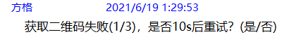
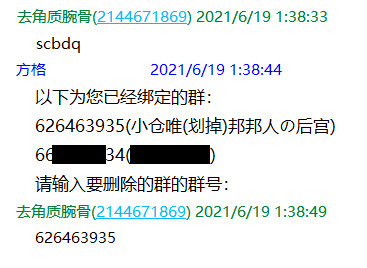
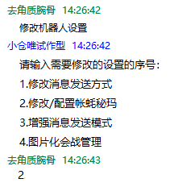

# 托管模式操作指南

<a-alert type="warning" message="提示" show-icon>
    <template slot="description">
        目前处于试运营阶段，不计费但也不对可用性、稳定性和性能做出保证，且可能存在问题和漏洞(可能会对可用性和稳定性造成影响)，还请知悉。
    </template>
</a-alert>

<a-alert type="warning" message="提示" show-icon>
    <template slot="description">
        目前仅<b>娱乐版（包括终极版中的娱乐版）</b>开启了托管模式试运营，其他版本暂未开启，这些版本续费时依旧按照以前的<a
            href="/shop/guide.html">“赞助指南”</a>进行，后续安排请关注后续通知与公告。
    </template>
</a-alert>

<a-alert type="info" message="提示" show-icon>
    <template slot="description">
        发送<b>“托管菜单”</b>可以查看全部指令。
    </template>
</a-alert>

<a-alert type="warning" message="文档编写中" show-icon>
    <template slot="description">
        此部分的文档还在编写之中，如有任何疑问请咨询维护组。
    </template>
</a-alert>

<b>下述托管机器人是指您自己托管于本平台享受服务的机器人或者我提供的用于查询/处理业务的机器人（如：3350529394（小仓唯二号机·改??））。</b>

<b>以下所有操作和指令 私聊任何托管机器人进行 或者 在任何托管机器人在的群聊进行 均可，有特别说明的除外（请不要私聊被冻结/离线的机器人）。</b>  

## 术语表
以下解释了术语与对应的含义：
术语|含义
:--|:--|:--
凳撸|登录
码|二维码
帐蚝|账号
口口|QQ
搔麻|扫码
秘玛|密码
## 第一次使用
### 开始之前

您需要确保您用于托管的机器人的账号符合以下条件：

- 必须<b>绑定手机</b>号，开启了<b>设备锁</b>。且手机号能够<b>正常使用</b>（以便解封时接收验证码）。
- 必须是干净，<b>自己注册</b>的QQ号，不能是淘宝或者其他渠道<b>购买</b>的。不能有任何<b>财产</b>（比如Q币），或者有其他用途（例如<b>打游戏</b>），或者有<b>私人</b>的聊天记录/好友/群，避免造成损失。
- 可以有好友之类的，但是最好不要加过很多群，只加了自己需要用机器人的群即可。
- 必须能够<b>正常登录</b>，且<b>提前</b>在自己手机上登录好（以便自助添加托管的机器人）。
- <b>可以自己修改密码</b>，以应对初期登录时的封号。

此外，您需要负责以下事项：

- 自行确定机器人是否<b>在线</b>，如果不在线，可以检查是否封号（冻结），如非此原因可以尝试重启机器人
- 自行<b>解封</b>QQ，初期登录因为异地登录，被腾讯怀疑是盗号，可能会有1~3次的封禁（当然如果不幸遇到了连续封号的情况，那最好还是换个号）。
- 自行<b>保护</b>QQ账号密码安全，维护组不会向第三方透露您的账号、密码、使用情况等信息（法律条款有规定的情况除外）。
- 修改密码后<b>及时</b>在托管平台更新密码并重启机器人（见[更改机器人设置](#%E6%9B%B4%E6%94%B9%E6%9C%BA%E5%99%A8%E4%BA%BA%E7%9A%84%E8%AE%BE%E7%BD%AE-%E5%AF%86%E7%A0%81%E7%AD%89)小节）

<b>另外，请阅读上方的“术语表”。</b>

### 添加第一个机器人
<b>在发送指令之前，请先加机器人为好友。</b> 
首先需要将您的QQ号提交到平台上托管：
<template>
    <a-steps direction="vertical" :current="4">
        <a-step title="开始" status="process">
            <template slot="description">
                向<b>托管机器人</b>发送“添加机器人”并同意知情声明 
                
            </template>
        </a-step>
        <a-step title="输入信息" status="process">
            <template slot="description">
                输入您要托管为机器人的账号 
                
            </template>
        </a-step>
        <a-step title="登录" status="process">
            <template slot="description">
                按提示使用手机QQ扫码<b>(不能从相册中扫码，需要使用另外一台设备对着屏幕扫码)</b>，并确认登录，之后耐心等待几分钟确认绑定结果 
                
                <a-alert type="warning" message="提示" show-icon>
                    <template slot="description">
                        如出现二维码获取失败（如下图），可以多试几次，如果反复失败，
                        可以等几个小时之后使用<b>“重启机器人”</b>命令尝试重新登录。如果每次都失败，可能是被拉入了黑名单，
                        此时可以先使用<b>“删除机器人”</b>删除旧的账号，然后更换个账号再尝试。 
                        
                    </template>
                </a-alert>
                

                <a-alert type="warning" message="提示" show-icon>
                    <template slot="description">
                        由于部分账号登录比较慢或者登录时出现一些可以忽略的错误，导致无法检测到在线的状态。因此，可以用以下的方法来检查您的机器人是否就绪：
                        <b>私聊向机器人发送“小仓唯在？”，获得回复即证明已经就绪。</b>
                    </template>
                </a-alert>
            </template>
        </a-step>
        <a-step title="完成" status="process">
            <template slot="description">
                如出现下图的提示，则说明已经添加成功，可以进行下一步了 
                
            </template>
        </a-step>
    </a-steps>
</template>

<b>强烈推荐您按照<a href="#%E6%9B%B4%E6%94%B9%E6%9C%BA%E5%99%A8%E4%BA%BA%E7%9A%84%E8%AE%BE%E7%BD%AE-%E5%AF%86%E7%A0%81%E7%AD%89">“修改机器人设置”</a>中所述补充自己的密码，以便重启后能够自动登录，否则有可能每次都要求您扫码登录。</b>

<a-alert type="info" message="提示" description="目前每个人最多能绑定2个机器人。" show-icon/>

### 绑定一个群
然后您需要为您的机器人绑定几个群，托管的机器人只会响应这些绑定群内的命令，而会忽略其他群的消息。  
此外，绑定群数的多少关系到每天产生的费用的多少。
<template>
    <a-steps direction="vertical" :current="4">
        <a-step title="输入信息" status="process">
            <template slot="description">
                向<b>托管机器人</b>发送“添加绑定群”并输入您想添加的群号，完成之后输入“结束”（如果您有多个机器人，在此之前会有机器人选择流程）： 
                
            </template>
        </a-step>
        <a-step title="完成" status="process">
            <template slot="description">
                如出现下图的提示，则说明已经成功添加了绑定群，可以愉快的进行玩耍了~ 
                
            </template>
        </a-step>
    </a-steps>
</template>

<a-alert type="info" message="提示" description="目前每个机器人最多能绑定5个群。" show-icon/>

### 开始使用
以上两步都完成了之后，可以到[功能手册](/guide/introduction)查看详细的使用说明然后就能愉快的使用了~。
<a-alert type="warning" message="提示" show-icon>
                    <template slot="description">
                        请一定阅读<a href="/announcement/hosting.html#%E5%85%B3%E4%BA%8E%E8%B4%A6%E5%8F%B7%E7%9A%84%E9%97%AE%E9%A2%98">“关于托管之后账号的异常情况说明”</a>。
                    </template>
                </a-alert>
### 遇到了问题？
可以尝试先重启机器人（向<b>托管机器人</b>发送“重启机器人”命令），观察问题是否解决。如果没有，请首先阅读[故障排除指南](./problem-solve.md)和[常见问题](./qa.md)，如果还是不能解决您的问题，欢迎直接询问维护组。

<b>此外，在汇报问题之前，请先确认当前机器人是否在线，以免给您带来困扰。</b>

## 暂时不用机器人了？
如果暂时不需要用机器人了，可以使用<b>“暂停机器人”</b>指令（如下所示），需要时再使用<b>“重启机器人”</b>指令重新启动。
<template>
    <a-steps direction="vertical" :current="4">
        <a-step title="确认信息" status="process">
            <template slot="description">
                向<b>托管机器人</b>发送“暂停机器人”并同意知情声明（如果您有多个机器人，在此之前会有机器人选择流程）： 
                
            </template>
        </a-step>
        <a-step title="完成" status="process">
            <template slot="description">
                如出现下图的提示，则说明已经成功暂停了托管的机器人。 
                
            </template>
        </a-step>
    </a-steps>
</template>

## 更换账号了/想删除机器人 
如果您要更换账号，那么请首先使用<b>“删除机器人”</b>指令（见下）删除旧的账号，再重复<b><a href="#%E6%B7%BB%E5%8A%A0%E7%AC%AC%E4%B8%80%E4%B8%AA%E6%9C%BA%E5%99%A8%E4%BA%BA">“第一次使用？”</a></b>中的步骤重新添加机器人以及绑定群。  
如果您很久都不会使用机器人了，可以使用<b>“删除机器人”</b>指令（见下）来完全移除机器人：
<template>
    <a-steps direction="vertical" :current="4">
        <a-step title="确认信息" status="process">
            <template slot="description">
                向<b>托管机器人</b>发送“删除机器人”并同意知情声明（如果您有多个机器人，在此之前会有机器人选择流程）： 
                
            </template>
        </a-step>
        <a-step title="完成" status="process">
            <template slot="description">
                如出现下图的提示，则说明已经成功删除了托管的机器人。 
                
            </template>
        </a-step>
    </a-steps>
</template>

## 想换群用了/想减少使用的群数
如果想将机器人更换一个群使用，可以首先使用<b>“删除绑定群”</b>指令（见下）删除旧的群，之后使用<b>“添加绑定群”</b>（见<a href="#%E7%BB%91%E5%AE%9A%E4%B8%80%E4%B8%AA%E7%BE%A4">“第一次使用？”中的“添加一个群”</a>）指令添加新的群。  
如果想减少使用的群数，可以使用<b>“删除绑定群”</b>（见下）来删除一些绑定的群。删除之后，机器人将不会响应这些群中的消息，同时每天产生的费用也会相应的减少。
<template>
    <a-steps direction="vertical" :current="4">
        <a-step title="输入信息" status="process">
            <template slot="description">
                向<b>托管机器人</b>发送“删除绑定群”并选择需要删除的群（如果您有多个机器人，在此之前会有机器人选择流程）： 
                
            </template>
        </a-step>
        <a-step title="同意知情声明及完成" status="process">
            <template slot="description">
                同意知情声明，如出现下图的提示，则说明已经成功删除了绑定群。 
                
            </template>
        </a-step>
    </a-steps>
</template>

## 更改机器人的设置(密码等)
<a-alert type="warning" message="提示" description="为保护您的账号安全，此部分操作只能 私聊任何托管机器人进行（请不要私聊被冻结/离线的机器人）。" show-icon/>
<b>如果您刚刚更改了密码，或者您刚刚添加了一个新的机器人，请按照下述步骤补充您机器人账号的密码。</b>
<template>
    <a-steps direction="vertical" :current="4">
        <a-step title="选择设置项" status="process">
            <template slot="description">
                向<b>托管机器人</b>发送“修改机器人设置”并选择需要修改的设置项，此处以“修改/配置机器人密码”为例（如果您机器人经常无法发出消息，可以尝试修改消息发送方式，可能会有缓解）。（如果您有多个机器人，在此之前会有机器人选择流程） 
                
            </template>
        </a-step>
        <a-step title="修改设置" status="process">
            <template slot="description">
                输入您托管的机器人的账号的密码（请确认密码正确，否则无法登录）。 
                
            </template>
        </a-step>
        <a-step title="完成" status="process">
            <template slot="description">
                如出现下图的提示，则说明已经成功修改了机器人的设置。 
                
            </template>
        </a-step>
    </a-steps>
</template>

## 查看机器人的状态
如果要查看您添加的机器人的概况，使用“我的机器人”指令：  
  
如有必要，可以查看指定机器人的详细情况（使用 “机器人详情 账号”指令），用于维护组做故障诊断：  
 
<a-divider />
也可以查看全部或者指定机器人的绑定群的情况（使用 “我的群 [账号]”指令）：  

## 查看消费&余额情况
<i>To Be Written...</i>