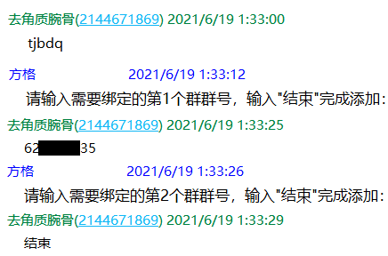

# 使用指南

<a-alert type="info" message="提示" show-icon>
    <template slot="description">
        发送<b>“托管菜单”</b>可以查看全部指令。
    </template>
</a-alert>

<b>
    以下所有操作和指令 私聊任何托管机器人进行 或者 在任何托管机器人在的群聊进行 均可，有特别说明的除外（请不要私聊被冻结/离线的机器人）。
</b>

## 第一次使用
### 开始之前

<b>术语表</b>   
为了规避信息往来中可能存在的风险，将部分词用谐音字进行了替换。
以下解释了替换之后的术语与对应的含义：
术语|含义
:--|:--|:--
凳撸|登录
码|二维码
帐蚝|账号
口口|QQ
搔麻|扫码
秘玛|密码

<b>托管模式账号需满足的条件</b>

- <b>绑定了手机</b>，开启了<b>设备锁</b>。且手机号能够<b>正常使用</b>（以便解封时接收验证码）。
- 是干净，<b>自己注册</b>的QQ号，不能是淘宝或者其他渠道<b>购买</b>的。
- 账号中不能有任何<b>财产</b>（比如Q币），或者有其他用途（例如<b>打游戏</b>），或者有<b>私人</b>的聊天记录/好友/群，以免造成损失。
- 能够<b>正常登录</b>，并且需要<b>提前</b>在自己手机上登录好（以便自助添加托管的机器人）。
- <b>可以自己修改密码</b>，以应对初期登录时可能的封号。

<b>我需要负责的内容</b>

- <b>妥善保护您的账号，确保您的账号安全。</b>若您的账号被冻结，您需要自行解冻。若您的账号已经不再可用，您需要自行更换。如果因为您对账号的保护不善造成了损失，您需要自行承担，维护组不负责任。
- <b>自行管理您账号上的好友与群。</b>请您注意您账号的加好友与加群情况，防止加入意料之外的群或者被意料之外的人添加好友而造成损失（如冻结）。另外，加入托管后默认会自动同意好友请求但不会自动同意加群请求，您需要手动同意。
- 修改密码后请<b>及时</b>在托管平台更新密码并重启机器人（见[更改机器人设置](#%E6%9B%B4%E6%94%B9%E6%9C%BA%E5%99%A8%E4%BA%BA%E7%9A%84%E8%AE%BE%E7%BD%AE-%E5%AF%86%E7%A0%81%E7%AD%89)小节）。

<b>什么是托管机器人？</b>  

<b>托管机器人是指您自己托管于本平台享受服务的机器人或者我提供的用于查询、处理业务的机器人（如：3367336630）。以下所有操作和指令 私聊任何托管机器人进行 或者 在任何托管机器人在的群聊进行 均可，有特别说明的除外（请不要私聊被冻结/离线的机器人）。</b>

<b>请确认：</b>  
<template>
  <a-checkbox><b>我已阅读[托管模式简介](/hosting/introduction)并对这一模式有了一个初步的了解。</b></a-checkbox> 
  <a-checkbox><b>我已阅读“术语表”理解了这些字的本意。</b></a-checkbox> 
  <a-checkbox><b>我已确认用作托管模式的账号满足“托管模式账号需满足的条件”。</b></a-checkbox> 
  <a-checkbox><b>我已阅读并了解“我需要负责的内容”</b></a-checkbox> 
  <a-checkbox><b>我已阅读并了解“什么是托管机器人？”</b></a-checkbox> 
  <a-checkbox><b>我已阅读并同意[托管机器人费用说明](/hosting/fee)</b></a-checkbox> 
  <a-checkbox><b>我理解托管初期由于外部不可抗力原因，机器人可能会被冻结或一段时间内无法回复群消息</b></a-checkbox> 
</template>

### 添加第一个机器人

<a-alert type="warning" message="注意" description="添加机器人至少需要有180云点(单群一个月的花费)。" show-icon />

<b>
    在发送指令之前，请先加机器人为好友。
</b>

<template>
    <a-steps direction="vertical" :current="4">
        <a-step title="获取云点" status="process">
            <template slot="description">
                <b>如果您是第一次添加机器人，请查看<a href="/hosting/fee.html#%E5%85%85%E5%80%BC%E4%BA%91%E7%82%B9">如何获取云点？</a>获得云点卡密并激活后再继续。</b>
            </template>
        </a-step>
        <a-step title="开始" status="process">
            <template slot="description">
                向<b>托管机器人</b>发送“添加机器人”并同意知情声明 
                <a-button type="primary" size="large" @click="info">
                    <b>托管机器人是哪个！！！</b>
                </a-button>
                

                
            </template>
        </a-step>
        <a-step title="输入信息" status="process">
            <template slot="description">
                输入您要托管为机器人的账号 
                
            </template>
        </a-step>
        <a-step title="登录" status="process">
            <template slot="description">
                会尝试自动进行登录。 
                <b>如果您见到以下提示，请联系维护组，并提供账号和密码，等待维护组为您手动处理登录：</b>

                <b><i>需要人工处理凳撸,请联系维护组并提供帐蚝、秘玛</i></b>
            </template>
        </a-step>
        <a-step title="完成" status="process">
            <template slot="description">
               当登录之后，接下来需要做的事就是等待登录结果。 
               <b>如果登录成功，您添加的这个机器人会向您发送一条消息以证明添加成功。</b> 
               <b>如果180秒（3分钟）内没有收到消息的话，您可以自己向这个机器人私聊发送“小仓唯在？”，如果有回复那么也已经添加成功。</b>
               <a-alert type="warning" message="遇到了问题？" show-icon>
                    <template slot="description">
                        如果收到了添加失败的通知，或者3分钟之后私聊您的机器人“小仓唯在？”没有回复的话，请再试一次。 
                        如果多次失败，建议等待几个小时之后再尝试。
                    </template>
                </a-alert>
            </template>
        </a-step>
    </a-steps>
</template>

<b>强烈推荐您按照<a
        href="#%E6%9B%B4%E6%94%B9%E6%9C%BA%E5%99%A8%E4%BA%BA%E7%9A%84%E8%AE%BE%E7%BD%AE-%E5%AF%86%E7%A0%81%E7%AD%89">“修改机器人设置”</a>中所述补充（或修改）自己的密码，以便重启后能够自动登录，否则有可能每次都要求您扫码登录。</b>

<a-alert type="info" message="提示" description="目前每个人最多能绑定2个机器人。" show-icon />

### 绑定一个群
然后您需要为您的机器人绑定几个群，托管的机器人只会响应这些绑定群内的命令，而会忽略其他群的消息。
此外，绑定群数的多少关系到每天产生的费用的多少。
<template>
    <a-steps direction="vertical" :current="4">
        <a-step title="输入信息" status="process">
            <template slot="description">
                向<b>托管机器人</b>发送“tjbdq”并输入您想添加的群号，完成之后输入“结束”（如果您有多个机器人，在此之前会有机器人选择流程）： 
                
            </template>
        </a-step>
        <a-step title="完成" status="process">
            <template slot="description">
                如出现下图的提示，则说明已经成功添加了绑定群，可以愉快的进行玩耍了~ 
                
                <a-alert type="warning" message="遇到了问题？" show-icon>
                    <template slot="description">
                        如果等待了超过1分钟都没有出现提示（无论失败还是成功），则可能是提示消息因故未能发出，请重新进行添加流程。
                    </template>
                </a-alert>
                

                <a-alert type="info" message="提示" show-icon>
                    <template slot="description">
                        需要注意的是，目前机器人<b>仅</b>会自动同意<b>好友</b>，<b>不会</b>自动同意加群请求，这部分由您<b>全权负责</b>。
                    </template>
                </a-alert>
            </template>
        </a-step>
    </a-steps>
</template>

### 开始使用
以上两步都完成了之后，就可以把机器人加入绑定的群中，然后到[功能手册](/guide/introduction)查看详细的使用说明然后就能愉快的使用了~

### 遇到了问题？

对于<b>刚刚进行了托管</b>的账号，请参考<a
    href="/hosting/introduction.html#%E5%85%B3%E4%BA%8E%E8%B4%A6%E5%8F%B7%E7%9A%84%E9%97%AE%E9%A2%98">“关于托管之后账号的异常情况说明”</a>。  

如果<b>几天之后</b>还是处于只能回复私聊消息不能回复群聊消息的状态的话，请参考[常见问题](./qa.md)尝试自行排查。  

<b>此外，需要说明的是，即使已经脱离托管初期的风控，能正常回复群私聊消息了，但突然又不能回复群聊消息，那么最大的可能是被风控或者是被冻结了，仍然请参考[常见问题](./qa.md)尝试自行排查。</b>  

如果以上方法皆无效，且问题仍然存在，请联系维护组排查。  

对于<b>其他的问题</b>，可以尝试先重启机器人（向<b>托管机器人</b>发送“重启机器人”命令），观察问题是否解决。如果没有，请阅读[常见问题](./qa.md)尝试自行解决，如果还是不能解决您的问题，欢迎直接询问维护组。  

<b>此外，在汇报问题之前，请先确认当前机器人是否在线，以免给您带来困扰。</b>  

## 暂时不用机器人了？
如果暂时不需要用机器人了，可以使用<b>“暂停机器人”</b>指令（如下所示），需要时再使用<b>“重启机器人”</b>指令重新启动。

<a-alert type="warning" message="注意" description="暂停机器人并不会停止扣费。" show-icon />

<template>
    <a-steps direction="vertical" :current="4">
        <a-step title="确认信息" status="process">
            <template slot="description">
                向<b>托管机器人</b>发送“暂停机器人”并同意知情声明（如果您有多个机器人，在此之前会有机器人选择流程）： 
                
            </template>
        </a-step>
        <a-step title="完成" status="process">
            <template slot="description">
                如出现下图的提示，则说明已经成功暂停了托管的机器人。 
                
                <a-alert type="warning" message="遇到了问题？" show-icon>
                    <template slot="description">
                        如果等待了超过1分钟都没有出现提示（无论失败还是成功），则可能是提示消息因故未能发出，请重新进行流程。
                    </template>
                </a-alert>
            </template>
        </a-step>
    </a-steps>
</template>

## 更换账号了/想删除机器人

<a-alert type="warning" message="注意" description="删除机器人会立即扣除当天的费用。" show-icon />

如果您要更换账号，那么请首先使用<b>“删除机器人”</b>指令（见下）删除旧的账号，再重复<b><a
        href="#%E6%B7%BB%E5%8A%A0%E7%AC%AC%E4%B8%80%E4%B8%AA%E6%9C%BA%E5%99%A8%E4%BA%BA">“第一次使用？”</a></b>中的步骤重新添加机器人以及绑定群。   
如果您很久都不会使用机器人了，可以使用<b>“删除机器人”</b>指令（见下）来完全移除机器人：
<template>
    <a-steps direction="vertical" :current="4">
        <a-step title="确认信息" status="process">
            <template slot="description">
                向<b>托管机器人</b>发送“删除机器人”并同意知情声明（如果您有多个机器人，在此之前会有机器人选择流程）： 
                
            </template>
        </a-step>
        <a-step title="完成" status="process">
            <template slot="description">
                如出现下图的提示，则说明已经成功删除了托管的机器人。 
                
                <a-alert type="warning" message="遇到了问题？" show-icon>
                    <template slot="description">
                        如果等待了超过1分钟都没有出现提示（无论失败还是成功），则可能是提示消息因故未能发出，请重新进行流程。
                    </template>
                </a-alert>
            </template>
        </a-step>
    </a-steps>
</template>

## 想换群用了/想减少使用的群数
如果想将机器人更换一个群使用，可以首先使用<b>“scbdq”</b>指令（见下）删除旧的群，之后使用<b>“tjbdq”</b>（见<a
    href="#%E7%BB%91%E5%AE%9A%E4%B8%80%E4%B8%AA%E7%BE%A4">“第一次使用？”中的“添加一个群”</a>）指令添加新的群。  
如果想减少使用的群数，可以使用<b>“scbdq”</b>（见下）来删除一些绑定的群。删除之后，机器人将不会响应这些群中的消息，同时每天产生的费用也会相应的减少，但是会立即扣除删除前后产生的费用差额（比如删除之前是3个群，删除之后只有2个了，两者费用相差了2云点，就会扣除这部分，然后每日结算中再按2个群扣费）。
<template>
    <a-steps direction="vertical" :current="4">
        <a-step title="输入信息" status="process">
            <template slot="description">
                向<b>托管机器人</b>发送“scbdq”并选择需要删除的群（如果您有多个机器人，在此之前会有机器人选择流程）： 
                
            </template>
        </a-step>
        <a-step title="同意知情声明及完成" status="process">
            <template slot="description">
                同意知情声明，如出现下图的提示，则说明已经成功删除了绑定群。 
                
                <a-alert type="warning" message="遇到了问题？" show-icon>
                    <template slot="description">
                        如果等待了超过1分钟都没有出现提示（无论失败还是成功），则可能是提示消息因故未能发出，请重新进行流程。
                    </template>
                </a-alert>
            </template>
        </a-step>
    </a-steps>
</template>

## 更改机器人的设置
<a-alert type="warning" message="提示" description="为保护您的账号安全，此部分操作只能 私聊任何托管机器人进行（请不要私聊被冻结/离线的机器人）。" show-icon />
<b>如果您刚刚更改了密码，或者您刚刚添加了一个新的机器人，请按照下述步骤补充您机器人账号的密码。</b>
<template>
    <a-steps direction="vertical" :current="4">
        <a-step title="选择设置项" status="process">
            <template slot="description">
                向<b>托管机器人</b>发送“修改机器人设置”并选择需要修改的设置项，此处以“修改/配置机器人密码”为例。（如果您有多个机器人，在此之前会有机器人选择流程） 
                
            </template>
        </a-step>
        <a-step title="修改设置" status="process">
            <template slot="description">
                输入您托管的机器人的账号的密码（请确认密码正确，否则无法登录）。 
                
            </template>
        </a-step>
        <a-step title="完成" status="process">
            <template slot="description">
                如出现下图的提示，则说明已经成功修改了机器人的设置。 
                
                <a-alert type="warning" message="遇到了问题？" show-icon>
                    <template slot="description">
                        如果等待了超过1分钟都没有出现提示（无论失败还是成功），则可能是提示消息因故未能发出，请重新进行流程。
                    </template>
                </a-alert>
            </template>
        </a-step>
    </a-steps>
</template>

## 查看机器人的状态
如果要查看您添加的机器人的概况，使用“我的机器人”指令：   
  
如有必要，可以查看指定机器人的详细情况（使用 “机器人详情 账号”指令），用于维护组做故障诊断：   

<a-divider />
也可以查看全部或者指定机器人的绑定群的情况（使用 “我的群 [账号]”指令）：  

## 查看消费&余额情况
请见[费用指南](/hosting/fee)。

