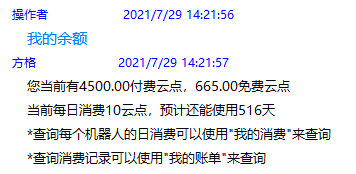
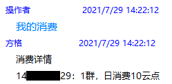
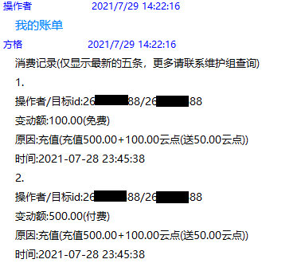

# 费用指南
## 费率
由于托管模式每个账号都需要消耗和之前公共机器人一样的资源，所以成本会有所上升。但是，如果和你的朋友合用同一个机器人，会比自己单独用一个机器人更便宜。   
<b>但请注意，若合租后续租户间或租户与出租者间出现了争端或纠纷并导致了损失，维护组概不负责。此外，账号的离线、冻结等异常情况请联系账号所有者解决，维护组无权也不能解决。</b>

<B>目前采用阶梯计价模式，并设有底价。总价格计算公式为：阶梯计费的基本价格总价+底价。 如：3个群的价格为：3*3+3 = 12云点/天</b>

以下为托管Bot基本价格和底价表：
<template>
    <a-table :pagination=false :columns="columns" :data-source="data">
        <a slot="group_num" slot-scope="text">{{ text }}</a>
    </a-table>
</template>

因为添加了机器人之后就会占用服务器的资源，无论有没有添加绑定群。所以，<b>对于没有添加绑定群的机器人，每天会扣除3云点作为资源使用费。</b>因此，请您检查有没有未绑定任何群的机器人，并及时绑定群或删除。

## 费用计算器
<b>各位如果需要估计自己机器人的花费，可以使用下面的计算器来计算。</b>

<a-alert type="info" message="说明" show-icon>
<template slot="description">
1. 10云点=1元 
2. 此价格为原价（划线价），不含任何优惠，实际费用可能较此处更低。 
3. 一月按30天计，实际费用按天计算，可能与上述计算器中的结果略有不同。 
4. 此价格包括原终极版的所有功能，包括完整的娱乐与会战功能。 
5. 机器人与添加机器人时的人绑定，因此，<b>请勿代他人添加/充值</b>，以免产生纠纷。 
6. 同一人绑定的不同机器人群数<B>不累计计算</B>，分别计算并分别扣费（如某人添加了两个绑定了一个群的机器人，则费用是两个单群的费用而非一个双群的费用）。 
</template>
</a-alert>

<template>
    

        <a-form-model ref="ruleForm" :model="form" :rules="rules" style="max-width: 400px;">
            
将会有多少群使用这个机器人呢？

            <a-form-model-item ref="group" prop="group">
                <a-input type='number' v-model="form.group" placeholder="请输入你的预计使用群数"
                    oninput="if(value.length>3)value=value.slice(0,3)" />
            </a-form-model-item>
            
这个机器人您预计将要使用多久？

            <a-form-model-item ref="usetime" prop="usetime">
                <a-input type='number' v-model="form.usetime" placeholder="请输入你的预计使用时间"
                    oninput="if(value.length>2)value=value.slice(0,2)">
                    <a-select slot="addonAfter" style="width: 80px" v-model="time_unit">
                        <a-select-option value="天">
                            &nbsp;&nbsp;天
                        </a-select-option>
                        <a-select-option value="月">
                            &nbsp;&nbsp;月
                        </a-select-option>
                        <a-select-option value="年">
                            &nbsp;&nbsp;年
                        </a-select-option>
                    </a-select>
                </a-input>
            </a-form-model-item>
            <a-form-model-item>{{getPrice}}</a-form-model-item>
        </a-form-model>
    

</template>

## 计费方式
固定时间按当时的群数扣费（一般在凌晨），余额小于0时停机（停止机器人）并提示欠费，余额不足以维持三天花费时提示余额不足。

### 注意
1. 添加机器人时<b>不会</b>扣费，但需要你<b>至少有</b>180云点(单群一个月的花费)。
2. 删除机器人会<b>立即扣除</b>当天的花费。
3. 删除绑定群会<b>立即扣除</b>删除前后产生的费用差额（比如删除之前是3个群，删除之后只有2个了，两者费用相差了2云点，就会扣除这部分，然后每日结算中再按2个群扣费）。
4. 欠费停机<b>五天后</b>如果还没有续费恢复机器人服务，则会<b>删除机器人（但数据不会删除）</B>以节省服务器资源。届时如果你需要使用机器人的话，需要重新添加。
5. 当你欠费（余额小于等于0）时<b>无法使用</b>“重启机器人”。

## 操作指南

### 购买卡密
首先赞助获得卡密：

 
<a-alert type="info" message="提示" show-icon>
        <template slot="description">
            在下单之前可以先去<a href="/announcement/saleactivity.html">促销活动页面</a>看看有没有什么新活动哦~
        </template>
</a-alert>
 

如您使用<b>支付宝</b>，请使用支付宝扫描下方二维码进入微店赞助（收货地址可随意填写，无需真实地址）：

</img>

如您使用<b>微信</b>，请使用微信扫描下方小程序二维码进入微店小程序：  
</img>

### 激活卡密
赞助获得卡密后用<b>主人的账号（切勿使用机器人账号）</b>私聊<B>托管机器人</b>发送“激活卡密”，按提示操作即可激活卡密。  
后续添加机器人等请参考<b><a href="/hosting">托管操作指南</a></b>。

<a-button type="primary" @click="info">什么是托管机器人？</a-button>

### 查询余额
私聊托管机器人 或者 在有托管机器人的群中发送 “我的余额”，即可得知当前余额，每日消费和预计能使用的天数。

如下图所示：

</img>

### 查询消费详情
私聊托管机器人 或者 在有托管机器人的群中发送 “我的消费”，可以查看具体的扣费项。

如下图所示：

</img>

### 查询扣费记录
私聊托管机器人 或者 在有托管机器人的群中发送 “我的账单”，可以查看详细的消费和充值记录。

如下图所示：

</img>

