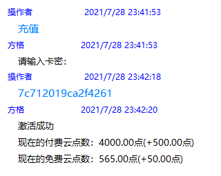

# 费用指南
## 费率
由于托管模式每个账号都需要消耗和之前公共机器人一样的资源，所以成本会有所上升。在新模式下，大约70%的人可以维持原有的资费。并且，如果和你的朋友或者群内其他人合用同一个机器人，甚至还会更便宜。  
<b>如果要合租，请慎重的选择合租对象，若后续出现了争端或纠纷并导致了损失，维护组不负责。此外，账号的离线、冻结等异常情况请联系账号所有者解决，维护组无权也不能解决。</b>

以下为托管Bot基本价格表：

<template>
    <a-table :pagination=false :columns="columns" :data-source="data">
        <a slot="group_num" slot-scope="text">{{ text }}</a>
    </a-table>
</template>

### 说明
1. 10云点=1元
2. 一月按30天计，实际费用按天计算，可能与上表略有不同。
3. 此价格包括原终极版的所有功能，包括完整的娱乐与会战功能。
4. <b>每群价格仅供参考，实际扣费以总价格为准。</b>
5. 因为添加了机器人之后就会占用服务器的资源，无论有没有添加绑定群。所以，<b>对于没有添加绑定群的机器人，每天会扣除一定的云点作为资源使用费。</b>因此，请您检查有没有未绑定任何群的机器人，并及时绑定群或删除。
6. 考虑到账号安全与稳定性，一个账号最多可以绑定五个群，但对于绑定的群的人数是没有限制的。
7. 机器人与添加机器人时的人绑定，因此，<b>请勿代他人添加/充值</b>，以免产生纠纷。

## 计费方式
固定时间按当时的群数扣费（一般在凌晨），余额小于0时停机（停止机器人）并提示欠费，余额不足以维持三天花费时提示余额不足。

### 注意
1. 添加机器人时<b>不会</b>扣费，但需要你<b>至少有</b>300云点(单群一个月的花费)。
2. 删除机器人会<b>立即扣除</b>当天的花费。
3. 删除绑定群会<b>立即扣除</b>删除前后产生的费用差额（比如删除之前是3个群，删除之后只有2个了，两者费用相差了2云点，就会扣除这部分，然后每日结算中再按2个群扣费）。
4. 欠费停机五天后如果还没有续费恢复机器人服务，则会删除机器人（但数据不会删除）以节省服务器资源。届时如果你需要使用机器人的话，需要重新添加。
5. 当你欠费（余额小于0）时<b>无法使用</b>“重启机器人”。

## 从旧模式迁移
原来在使用会战实用版、娱乐版与终极版的各位，剩余的授权时间<b>（以2021-6-20 00:00:00为基准计算，现在是否过期不影响）</b>按以下规则转换为付费云点：  
<b>会战实用版</b>：每剩余1天折合5云点，不足一天按一天算  
<b>娱乐版</b>：每剩余1天折合5.33云点，不足一天按一天算   
<b>终极版</b>：每剩余1天折合6云点，不足一天按一天算  
<b>这些云点会直接充值到最后一次为该群充值卡密的人的账号中。因此，如有之前有授权群而没有收到转换的云点的，请联系我协助解决。</b>

## 操作指南

### 充值云点
首先点击下方按钮前往商店赞助获得卡密：  
<a-button type="primary">
    <a href="http://shop.xcwbot.com" target="_blank">打开商店页面</a>
</a-button>

然后私聊托管机器人发送“充值”，按提示操作即可。

<a-button type="primary" @click="info">什么是托管机器人？</a-button>

如下图所示：

### 查询余额
私聊托管机器人 或者 在有托管机器人的群中发送 “我的余额”，即可得知当前余额，每日消费和预计能使用的天数。

如下图所示：

### 查询消费详情
私聊托管机器人 或者 在有托管机器人的群中发送 “我的消费”，可以查看具体的扣费项。  

如下图所示：

### 查询扣费记录
私聊托管机器人 或者 在有托管机器人的群中发送 “我的账单”，可以查看详细的消费和充值记录。

如下图所示：

