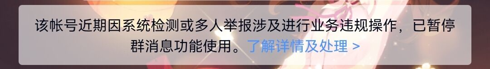

# 常见问题

### <b>1. 我的机器人有些/全部功能没有反应</b>
- <b>(首先排查) </b>账号是否被限制群聊？   
  <b>自己登上机器人账号，在群聊中随便发几条消息，如果发不出去，而且气泡左端有感叹号，就说明账号被限制群聊了</b>     
  解决方案：    
  <b>多换几个群/多发几条消息/把机器人拉个新群/过一会再试，直到刷出下面的横幅为止，即可进入解封：</b>    
  
- （90%可能）<b>处于腾讯的风控期间中，可以接受处理消息，不能发送消息（比如报刀没有反应但是报上了）</b>   
  可以尝试以下的解决办法： 
  - 修改发送方式（见<a href="/hosting/#%E6%9B%B4%E6%94%B9%E6%9C%BA%E5%99%A8%E4%BA%BA%E7%9A%84%E8%AE%BE%E7%BD%AE-%E5%AF%86%E7%A0%81%E7%AD%89">“更改机器人的设置”</a>） 
  - 打开“增强消息发送模式”（见<a href="/hosting/#%E6%9B%B4%E6%94%B9%E6%9C%BA%E5%99%A8%E4%BA%BA%E7%9A%84%E8%AE%BE%E7%BD%AE-%E5%AF%86%E7%A0%81%E7%AD%89">“更改机器人的设置”</a>，适用于部分功能能够使用，有些功能没有反应的情况）
  - 打开/关闭“图片化会战管理”（见<a href="/hosting/#%E6%9B%B4%E6%94%B9%E6%9C%BA%E5%99%A8%E4%BA%BA%E7%9A%84%E8%AE%BE%E7%BD%AE-%E5%AF%86%E7%A0%81%E7%AD%89">“更改机器人的设置”</a>，适用于会战管理没反应的情况）
  - 清除密码后重新扫码（见<a href="/hosting/#%E6%9B%B4%E6%94%B9%E6%9C%BA%E5%99%A8%E4%BA%BA%E7%9A%84%E8%AE%BE%E7%BD%AE-%E5%AF%86%E7%A0%81%E7%AD%89">“更改机器人的设置”</a>—“2.修改/配置账号密码”—输入“清除”以清除密码）
  - 等待（几小时到几天不等）<b>（尤其适用于刚刚托管的机器人）</b>  
  - 重启
  - 删除机器人后再重新添加（可以多试几次）
  - 换号<b>（如果以上都没有解决，那确实就没办法了，换号吧）</b>  
- （80%可能）<b>被冻结，请自行登录账号按提示解封</b>  
- （70%可能）<b>没有启用这项功能，请启用后再试</b>  
- （60%可能）<b>指令打错了，建议查看文档后重试</b>  
- （50%可能）<b>你目前使用指令的这个群不是机器人的绑定群，请添加为绑定群之后再试（见<a href="/hosting/#%E7%BB%91%E5%AE%9A%E4%B8%80%E4%B8%AA%E7%BE%A4">添加绑定群</a>）</b>

### <b>2. 我之前有充值过，但是我没有收到转换的余额</b>
- （80%可能） 之前的充值人和现在添加机器人的人并非同一账号，请联系维护组查询之前的充值人/账号，并完成转移流程。  
- （60%可能） 上一次充值过于久远，没有记录充值人信息，故无法转换。可查看群内表格“没有记录充值人信息的群”确认。  
  如需认领，请联系维护组提供：为该群充值时的卡密/聊天记录/支付记录之一即可。  
